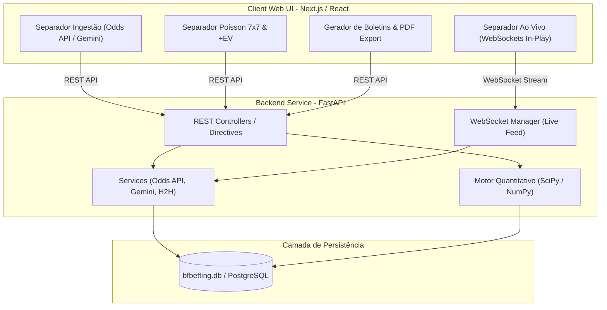

# Plano de Migração Tecnológica | BF Analista de Futebol

Este documento apresenta uma análise exaustiva e um plano de arquitetura para a migração tecnológica do aplicativo **BF Analista de Futebol**, atualmente estruturado em **Streamlit** e **Python**. 

> [!NOTE]
> **Estado Atual do Projeto:** O aplicativo utiliza Streamlit como interface reativa monolítica, SQLite como persistência de dados (`database/bfbetting.db`), e motores de ingestão em background com cálculos estatísticos de Poisson (`models/poisson.py`), Kelly Criterion e scraping de dados desportivos.

---

## 1. Tecnologias Compatíveis & Arquiteturas Propostas

Para migrar a aplicação mantendo a precisão quantitativa e a funcionalidade em tempo real, avaliam-se três arquiteturas principais:

### Opção A: Arquitetura Desacoplada Web Modern (Recomendada)
- **Frontend:** **Next.js 14+ (React / TypeScript)** ou **Vite + React** com **Tailwind CSS** & **Shadcn UI**.
- **Backend:** **FastAPI (Python 3.11+)** expondo APIs RESTful e WebSockets para partidas em direto.
- **Camada de Dados:** SQLite mantido ou **PostgreSQL** com **SQLAlchemy 2.0** / **Alembic** e **Pydantic v2**.
- **Processamento Assíncrono:** **Celery + Redis** ou **AsyncIO background tasks** para ingestão de Odds e Web Scraping.
- **Vantagens:**
  - Preserva **100% dos motores estatísticos em Python** (SciPy, NumPy, Pandas, Poisson).
  - Elimina reruns totais do Streamlit, permitindo atualizações em tempo real cirúrgicas via WebSockets nas tabelas in-play (`live_matches`).
  - Design premium e responsivo (Desktop e Mobile) com componentes UI de última geração.

### Opção B: Full-Stack Pure Python (Migração Rápida)
- **Framework:** **Reflex** (antigo Pynecone) ou **NiceGUI**.
- **Backend Integrado:** FastAPI embutido em Python.
- **Camada de Dados:** SQLite com SQLModel / Peewee.
- **Vantagens:**
  - Escreve interface e lógica exclusivamente em Python, mas compila para React no frontend.
  - Baixa curva de aprendizagem para equipas focadas em Python.
  - Permite componentes reativos finos e gestão de estado global sem re-executar todo o script.

### Opção C: Aplicação Native Desktop (Execução Local / Offline)
- **Framework:** **PyQt6 / PySide6** ou **Tauri (React + Rust/Python backend sidecar)**.
- **Vantagens:**
  - Substitui scripts `.bat` / `.vbs` por um executável único nativo (.exe / .app).
  - Desempenho máximo sem dependência de browser local ou portas HTTP.

---

## 2. Matriz Comparativa de Tecnologias

| Critério | Streamlit (Atual) | Opção A: FastAPI + Next.js | Opção B: Reflex (Python) | Opção C: PyQt6 Native |
| :--- | :--- | :--- | :--- | :--- |
| **Desempenho da UI** | Médio (Reruns de página) | ⚡ Excelente (Virtual DOM / SPA) | 🚀 Bom (React compilado) | 🖥️ Excelente (Nativo) |
| **Atualização Ao Vivo (In-Play)** | Polling / Manual | 🔴 WebSockets em tempo real | 🔴 WebSockets nativos | ⚡ Timers de Thread |
| **Reaproveitamento de Código Python** | 100% | 100% Backend | 100% Backend + UI | 100% |
| **Flexibilidade de Design** | Limitada | 🎨 Total (CSS Custom / Tailwind) | 🎨 Alta | 🎨 Média |
| **Esforço de Migração** | N/A | 🛠️ Médio / Alto | 🛠️ Baixo / Médio | 🛠️ Médio |

---

## 3. Estrutura Proposta da Nova Arquitetura (Opção A)

---

## 4. Plano de Implementação em Fases

### Fase 1: Isolamento do Core & Criação da API (Backend)
#### [NEW] `backend/app/main.py`
- Inicialização do FastAPI com CORS, middleware e rotas principais.

#### [NEW] `backend/app/services/poisson_service.py`
- Refatoração de [poisson.py](file:///Users/brunofilipe/Documents/Projectos/bf-betting-strategies/models/poisson.py) em serviços desacoplados da UI.

#### [NEW] `backend/app/services/ingestion_service.py`
- Encapsulamento de [odds_api_ingestion.py](file:///Users/brunofilipe/Documents/Projectos/bf-betting-strategies/services/odds_api_ingestion.py), [live_matches_service.py](file:///Users/brunofilipe/Documents/Projectos/bf-betting-strategies/services/live_matches_service.py) e [gemini_ingestion.py](file:///Users/brunofilipe/Documents/Projectos/bf-betting-strategies/services/gemini_ingestion.py).

#### [NEW] `backend/app/database/models.py` & `backend/app/database/connection.py`
- Mapeamento das tabelas SQLite (`matches`, `live_matches`, `evaluations`, `bet_slips`, `app_settings`, `ingestion_logs`) utilizando SQLAlchemy 2.0 ORM com tipagem estrita Pydantic.

---

### Fase 2: Desenvolvimento do Frontend (Web UI)
#### [NEW] `frontend/components/IngestionTab.tsx`
- Interface para seleção de ligas, filtros de datas e trigger de descarregamento via FastAPI.

#### [NEW] `frontend/components/LiveMatchesTab.tsx`
- Tabela reativa ligada a WebSockets para atualização imediata de minutos, golos e odds in-play.

#### [NEW] `frontend/components/PoissonMatrixView.tsx`
- Visualização gráfica de matrizes 7x7 com heatmaps interativos (Recharts / Chart.js).

#### [NEW] `frontend/components/BetSlipsTab.tsx`
- Construtor de boletins combinados com filtro anti-duplicação e exportador PDF no browser.

---

### Fase 3: Validação & Testes
- **Testes Unitários:** Validação das matrizes de Poisson e Kelly Criterion com `pytest` comparando com os outputs atuais do aplicativo Streamlit.
- **Testes de Carga & Concorrência:** Garantir suporte a múltiplos pedidos de ingestão e WebSockets sem bloqueio do evento loop (`asyncio`).
- **Validação Par a Par:** Comparação entre os boletins gerados no Streamlit e os gerados na nova arquitetura.

---

## 5. Questões Abertas & Recomendações
> [!IMPORTANT]
> **Prioridade de Deploy:** A migração pretende manter a aplicação como executável local (Desktop) ou disponibilizá-la na Web / Nuvem para múltiplos utilizadores?
> - Se for **Local Desktop**: Recomenda-se a **Opção B (Reflex)** ou um empacotador Tauri.
> - Se for **SaaS / Web**: Recomenda-se a **Opção A (FastAPI + Next.js)**.

> [!TIP]
> **Reaproveitamento Total:** A estrutura de ficheiros atual em `services/` e `models/` já possui uma excelente separação de conceitos, o que tornará o processo de migração do backend rápido e sem risco de perda de lógica estatística.
